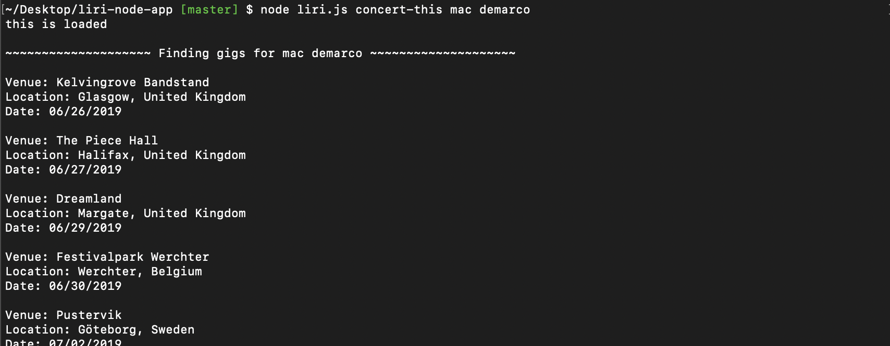
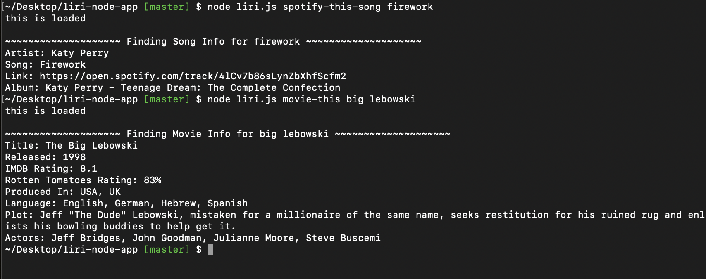

# liri-node-app

* This app is a CLI App. In order to run this app you will need to install node. In the terminal/cmd prompt run "node liri.js" to start the app. The app will run but nothing will happen because we need to give it arguments in order to know what work we are doing. If you would like to run the app with the provided input from the local random.txt file simply just run the command "node liri.js do-what-it-says". If you would like to look up a concerts from a specific artist run "node liri.js concert-this (artist/band name here)". Curious about a song you heard? Run "node liri.js spotify-this-song (song name here)". If you prefer movies you can look them up as well with the command "node liri.js movie-this (movie name here)".

## Technologies used (Run "npm i" to install packages):
* Node.js 
* Moment.js
* Axios
* DotEnv

## API's used
* Node-Spotify-API
* OMDB API
* Bands In Town API

## Author: Gabriel Jacobs